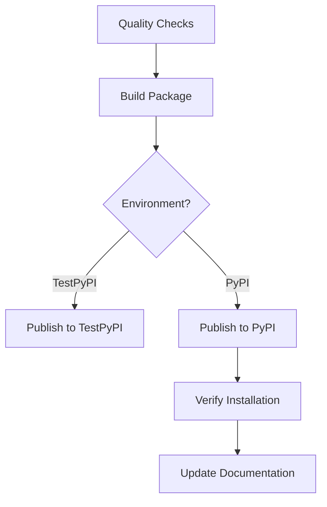

# GitHub Actions Setup Guide

## 🚀 **Automated CI/CD Workflows Created!**

I've created comprehensive GitHub Actions workflows for your Real Simple Stats package. Here's what you now have:

## 📁 **Workflow Files**

### 1. **`.github/workflows/publish.yml`** - PyPI Publishing
- **Triggers**: New releases, manual dispatch
- **Features**: Quality checks, build, test/production PyPI publishing
- **Environments**: Supports both TestPyPI and PyPI

### 2. **`.github/workflows/ci.yml`** - Continuous Integration
- **Triggers**: Push to main/develop, pull requests
- **Features**: Multi-OS testing, linting, security checks, documentation builds

### 3. **`.github/workflows/docs.yml`** - Documentation Deployment
- **Triggers**: Documentation changes, manual dispatch
- **Features**: GitHub Pages deployment, PR previews, ReadTheDocs integration

## ⚙️ **Required Setup Steps**

### 1. **PyPI API Tokens**

You need to create API tokens for PyPI publishing:

#### **For PyPI (Production)**
1. Go to [PyPI Account Settings](https://pypi.org/manage/account/)
2. Scroll to "API tokens" section
3. Click "Add API token"
4. Name: `real-simple-stats-github-actions`
5. Scope: `Entire account` (or specific to your project)
6. Copy the token (starts with `pypi-`)

#### **For TestPyPI (Testing)**
1. Go to [TestPyPI Account Settings](https://test.pypi.org/manage/account/)
2. Follow same steps as above
3. Copy the token

### 2. **GitHub Repository Secrets**

Add these secrets to your GitHub repository:

1. Go to your repository on GitHub
2. Click **Settings** → **Secrets and variables** → **Actions**
3. Click **New repository secret** and add:

```
Name: PYPI_API_TOKEN
Value: pypi-xxxxxxxxxxxxxxxxxxxxxxxxxxxxxxxx

Name: TEST_PYPI_API_TOKEN  
Value: pypi-xxxxxxxxxxxxxxxxxxxxxxxxxxxxxxxx
```

### 3. **GitHub Environments (Optional but Recommended)**

Create environments for additional security:

1. Go to **Settings** → **Environments**
2. Create environment: `pypi`
   - Add protection rules (require reviews, restrict to main branch)
   - Add environment secret: `PYPI_API_TOKEN`
3. Create environment: `testpypi`
   - Add environment secret: `TEST_PYPI_API_TOKEN`

### 4. **GitHub Pages Setup**

Enable GitHub Pages for documentation:

1. Go to **Settings** → **Pages**
2. Source: **Deploy from a branch**
3. Branch: **gh-pages** (will be created automatically)
4. Folder: **/ (root)**

## 🎯 **Workflow Features**

### **Publishing Workflow (`publish.yml`)**

#### **Automatic Triggers**
- ✅ **New Release**: Automatically publishes to PyPI when you create a GitHub release
- ✅ **Manual Dispatch**: Publish to TestPyPI or PyPI manually

#### **Quality Gates**
- ✅ **Multi-Python Testing**: Tests on Python 3.7-3.12
- ✅ **Code Quality**: Black formatting, Flake8 linting, MyPy type checking
- ✅ **Test Coverage**: Comprehensive test suite with coverage reporting
- ✅ **Package Validation**: Builds and validates package before publishing

#### **Publishing Process**


### **CI Workflow (`ci.yml`)**

#### **Multi-Matrix Testing**
- **Operating Systems**: Ubuntu, Windows, macOS
- **Python Versions**: 3.7, 3.8, 3.9, 3.10, 3.11, 3.12
- **Optimized Matrix**: Reduced combinations for faster CI

#### **Quality Checks**
- ✅ **Formatting**: Black code formatting validation
- ✅ **Linting**: Flake8 style and error checking
- ✅ **Type Checking**: MyPy static analysis
- ✅ **Security**: Safety and Bandit security scanning
- ✅ **Documentation**: Sphinx documentation building
- ✅ **Package**: Build and installation testing
- ✅ **Pre-commit**: All pre-commit hooks validation

### **Documentation Workflow (`docs.yml`)**

#### **Automatic Deployment**
- ✅ **GitHub Pages**: Automatic deployment on main branch changes
- ✅ **PR Previews**: Documentation previews for pull requests
- ✅ **Link Checking**: Validates all documentation links
- ✅ **ReadTheDocs**: Ready for ReadTheDocs integration

## 🚀 **How to Use**

### **Publishing a New Version**

#### **Method 1: GitHub Release (Recommended)**
1. Update version in `pyproject.toml`
2. Update `CHANGELOG.md`
3. Commit and push changes
4. Create a new release on GitHub:
   - Tag: `v0.2.1` (follow semantic versioning)
   - Title: `Release 0.2.1`
   - Description: Copy from changelog
5. **Automatic**: Workflow runs and publishes to PyPI

#### **Method 2: Manual Dispatch**
1. Go to **Actions** → **Publish to PyPI**
2. Click **Run workflow**
3. Choose environment: `testpypi` or `pypi`
4. Click **Run workflow**

### **Testing Before Release**

#### **Test on TestPyPI First**
```bash
# Manual dispatch to TestPyPI
# Then test installation:
pip install -i https://test.pypi.org/simple/ real-simple-stats
```

### **Monitoring Workflows**

#### **Check Workflow Status**
- Go to **Actions** tab in your repository
- Monitor running workflows
- Check logs for any failures

#### **Badges for README**
Add these badges to your README:

```markdown
[](https://github.com/yourusername/real_simple_stats/actions)
[](https://pypi.org/project/real-simple-stats/)
[](https://yourusername.github.io/real_simple_stats/)
```

## 🔧 **Customization Options**

### **Modify Python Versions**
Edit the matrix in workflows:
```yaml
python-version: ['3.8', '3.9', '3.10', '3.11', '3.12']  # Remove 3.7 if needed
```

### **Add More Quality Checks**
Add to CI workflow:
```yaml
- name: Run additional checks
  run: |
    # Add your custom checks here
    pytest --doctest-modules real_simple_stats/
```

### **Customize Documentation**
Modify `docs.yml` for different deployment targets:
- ReadTheDocs webhook
- Netlify deployment
- Custom hosting

## 📊 **Workflow Benefits**

### **For You**
- ✅ **Automated Publishing**: No manual PyPI uploads
- ✅ **Quality Assurance**: Catches issues before release
- ✅ **Multi-Platform Testing**: Ensures compatibility
- ✅ **Documentation**: Always up-to-date docs

### **For Contributors**
- ✅ **Immediate Feedback**: PR checks show issues quickly
- ✅ **Consistent Standards**: Automated formatting and linting
- ✅ **Documentation Previews**: See doc changes before merge

### **For Users**
- ✅ **Reliable Releases**: Thoroughly tested packages
- ✅ **Up-to-date Documentation**: Always reflects latest code
- ✅ **Multiple Python Versions**: Broad compatibility

## 🎯 **Next Steps**

1. **Set up secrets** (PyPI tokens)
2. **Enable GitHub Pages**
3. **Create your first release** to test the workflow
4. **Add workflow badges** to your README
5. **Monitor and customize** as needed

## 🔍 **Troubleshooting**

### **Common Issues**

#### **PyPI Publishing Fails**
- Check API token is correct and has proper scope
- Verify package name isn't taken
- Ensure version number is incremented

#### **Tests Fail**
- Check if dependencies are properly specified
- Verify test compatibility across Python versions
- Review test matrix configuration

#### **Documentation Build Fails**
- Check Sphinx configuration
- Verify all referenced files exist
- Review documentation requirements

### **Getting Help**
- Check workflow logs in GitHub Actions
- Review GitHub Actions documentation
- Open an issue if you encounter problems

---

**Your Real Simple Stats package now has professional-grade CI/CD automation!** 🚀

The workflows will ensure every release is thoroughly tested, properly built, and automatically published to PyPI with comprehensive quality checks.
