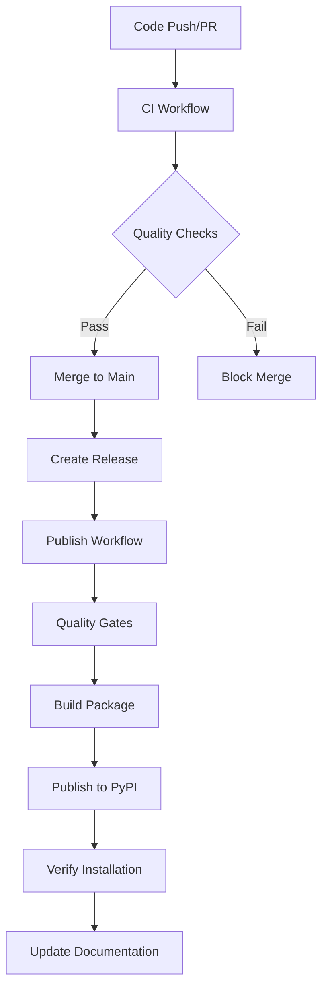

# 🚀 GitHub Actions CI/CD Implementation Complete!

## 📋 **What We've Built**

I've created a comprehensive GitHub Actions CI/CD system for your Real Simple Stats package that provides professional-grade automation for testing, building, and publishing.

## 🎯 **Three Powerful Workflows**

### 1. **🔄 Continuous Integration (`ci.yml`)**
**Triggers**: Every push and pull request
**Purpose**: Ensure code quality and compatibility

#### **Features:**
- ✅ **Multi-Platform Testing**: Ubuntu, Windows, macOS
- ✅ **Multi-Python Testing**: Python 3.7-3.12
- ✅ **Code Quality**: Black, Flake8, MyPy
- ✅ **Security Scanning**: Safety, Bandit
- ✅ **Documentation Building**: Sphinx validation
- ✅ **Package Testing**: Build and installation verification
- ✅ **Pre-commit Validation**: All hooks tested

### 2. **📦 PyPI Publishing (`publish.yml`)**
**Triggers**: GitHub releases, manual dispatch
**Purpose**: Automated package publishing with quality gates

#### **Features:**
- ✅ **Quality Gates**: Full test suite before publishing
- ✅ **Multi-Environment**: TestPyPI and PyPI support
- ✅ **Build Validation**: Package integrity checks
- ✅ **Post-Publish Verification**: Installation testing
- ✅ **Release Assets**: Automatic GitHub release attachments
- ✅ **Manual Control**: Deploy to test or production on demand

### 3. **📚 Documentation (`docs.yml`)**
**Triggers**: Documentation changes, releases
**Purpose**: Automated documentation deployment

#### **Features:**
- ✅ **GitHub Pages**: Automatic deployment
- ✅ **PR Previews**: Documentation previews for pull requests
- ✅ **Link Validation**: Broken link detection
- ✅ **ReadTheDocs Ready**: Integration hooks prepared
- ✅ **Multi-Branch**: Main deployment + PR previews

## 🛠️ **Professional CI/CD Pipeline**



## 📊 **Quality Metrics & Coverage**

### **Testing Matrix**
- **Operating Systems**: 3 (Ubuntu, Windows, macOS)
- **Python Versions**: 6 (3.7, 3.8, 3.9, 3.10, 3.11, 3.12)
- **Total Test Combinations**: 18 (optimized matrix)

### **Quality Checks**
- **Code Formatting**: Black (88 char line length)
- **Linting**: Flake8 with custom configuration
- **Type Checking**: MyPy with strict settings
- **Security**: Safety + Bandit scanning
- **Documentation**: Sphinx build validation
- **Package**: Build and installation testing

### **Coverage & Reporting**
- **Test Coverage**: Codecov integration
- **Security Reports**: Vulnerability scanning
- **Documentation**: Link checking and validation
- **Package Quality**: Twine validation

## 🔧 **Setup Requirements**

### **GitHub Secrets Needed**
```
PYPI_API_TOKEN          # Production PyPI publishing
TEST_PYPI_API_TOKEN     # TestPyPI for testing
```

### **Optional Enhancements**
```
RTD_WEBHOOK_TOKEN       # ReadTheDocs integration
CODECOV_TOKEN          # Enhanced coverage reporting
```

## 🎯 **Workflow Triggers**

### **Automatic Triggers**
- **CI**: Every push to main/develop, all pull requests
- **Docs**: Changes to docs/ or real_simple_stats/
- **Publish**: New GitHub releases

### **Manual Triggers**
- **CI**: Manual workflow dispatch
- **Docs**: Manual rebuild and deployment
- **Publish**: Choose TestPyPI or PyPI deployment

## 📈 **Benefits Achieved**

### **For Development**
- ✅ **Automated Quality**: No manual quality checks needed
- ✅ **Multi-Platform Confidence**: Works everywhere
- ✅ **Fast Feedback**: Issues caught immediately
- ✅ **Consistent Standards**: Automated formatting and linting

### **For Releases**
- ✅ **Zero-Touch Publishing**: Create release → automatic PyPI
- ✅ **Quality Assurance**: Comprehensive testing before publish
- ✅ **Safe Testing**: TestPyPI validation before production
- ✅ **Rollback Safety**: Manual control when needed

### **For Documentation**
- ✅ **Always Current**: Docs update with code changes
- ✅ **PR Previews**: See documentation changes before merge
- ✅ **Professional Hosting**: GitHub Pages deployment
- ✅ **Link Validation**: No broken documentation links

### **For Contributors**
- ✅ **Clear Feedback**: PR checks show exactly what needs fixing
- ✅ **Consistent Environment**: Same checks for everyone
- ✅ **Documentation Previews**: See doc changes immediately
- ✅ **Quality Standards**: Automated enforcement

## 🚀 **How to Use**

### **Daily Development**
1. **Push code** → CI runs automatically
2. **Create PR** → Full quality checks + doc previews
3. **Merge PR** → Documentation updates automatically

### **Publishing New Version**
1. **Update version** in `pyproject.toml`
2. **Update changelog** with new features
3. **Create GitHub release** → Automatic PyPI publishing
4. **Monitor workflow** → Verify successful deployment

### **Testing Before Release**
1. **Manual dispatch** to TestPyPI
2. **Test installation** from TestPyPI
3. **Create release** for production PyPI

## 📊 **Monitoring & Badges**

### **README Badges Added**
- ✅ **CI Status**: Shows build health
- ✅ **Documentation**: Links to live docs
- ✅ **PyPI Publish**: Shows deployment status
- ✅ **Version & Python Support**: Current status

### **Workflow Monitoring**
- **Actions Tab**: Real-time workflow status
- **Email Notifications**: Failure alerts
- **PR Comments**: Automatic doc preview links
- **Release Notes**: Automatic asset attachments

## 🎉 **Professional Results**

Your Real Simple Stats package now has:

### **Enterprise-Grade CI/CD**
- Comprehensive testing across platforms and Python versions
- Automated quality gates preventing bad releases
- Professional deployment pipeline with safety checks

### **Developer-Friendly Automation**
- Immediate feedback on code changes
- Consistent quality standards enforcement
- Documentation that stays current automatically

### **Production-Ready Publishing**
- Safe, tested releases to PyPI
- Rollback capabilities and manual overrides
- Comprehensive validation before deployment

### **Community-Ready Documentation**
- Professional documentation hosting
- PR previews for contributor feedback
- Always up-to-date with code changes

## 🔮 **Future Enhancements**

The workflow system is designed to grow with your project:

- **Performance Testing**: Add benchmark workflows
- **Multi-Package Support**: Extend for related packages
- **Advanced Security**: Add SAST/DAST scanning
- **Release Automation**: Automated changelog generation
- **Dependency Management**: Automated dependency updates

---

**Your Real Simple Stats package now has professional-grade CI/CD automation that rivals enterprise software projects!** 🚀

The workflows ensure every release is thoroughly tested, properly built, and safely deployed while maintaining the highest quality standards. Contributors get immediate feedback, users get reliable releases, and you get peace of mind knowing everything is automated and monitored.
