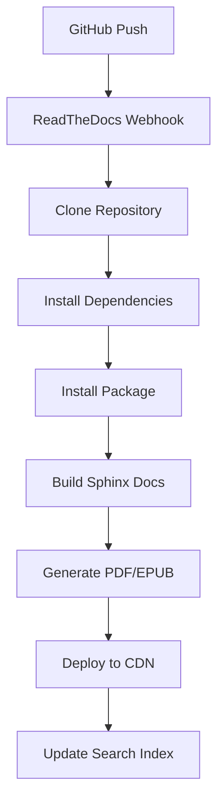

# ReadTheDocs Setup Guide

## 📚 **Professional Documentation Hosting**

I've created a comprehensive ReadTheDocs configuration for your Real Simple Stats package that provides professional documentation hosting with advanced features.

## 📁 **Configuration File**

### **`.readthedocs.yml`** - Complete Configuration

The configuration includes:

- ✅ **Modern Build Environment**: Ubuntu 22.04 with Python 3.11
- ✅ **Multiple Formats**: HTML, PDF, and EPUB documentation
- ✅ **Advanced Search**: Customized search ranking and filtering
- ✅ **Development Installation**: Package installed in development mode
- ✅ **Dependency Management**: Automatic installation of dev dependencies
- ✅ **Build Optimization**: Pre-build and post-checkout hooks

## 🚀 **Setup Steps**

### 1. **Create ReadTheDocs Account**

1. Go to [ReadTheDocs.org](https://readthedocs.org/)
2. Sign up with your GitHub account
3. Connect your GitHub repositories

### 2. **Import Your Project**

1. Click **"Import a Project"**
2. Select **"Import from GitHub"**
3. Find and select `real_simple_stats`
4. Click **"Next"**

### 3. **Configure Project Settings**

#### **Basic Settings**
- **Name**: `real-simple-stats`
- **Repository URL**: `https://github.com/yourusername/real_simple_stats`
- **Default Branch**: `main`
- **Language**: `English`
- **Programming Language**: `Python`

#### **Advanced Settings**
- **Documentation Type**: `Sphinx Html`
- **Requirements File**: `docs/requirements.txt`
- **Python Configuration File**: `.readthedocs.yml`
- **Use system packages**: ✅ (checked)

### 4. **Build Configuration**

The `.readthedocs.yml` file automatically configures:

```yaml
# Modern build environment
build:
  os: ubuntu-22.04
  tools:
    python: "3.11"

# Sphinx with HTML builder
sphinx:
  builder: html
  configuration: docs/source/conf.py
  fail_on_warning: false

# Python package installation
python:
  install:
    - method: pip
      path: .
      extra_requirements:
        - dev
    - requirements: docs/requirements.txt
```

### 5. **Enable Advanced Features**

#### **Multiple Format Support**
Your documentation will be available in:
- **HTML**: Interactive web documentation
- **PDF**: Downloadable PDF version
- **EPUB**: E-book format for offline reading

#### **Custom Search Configuration**
- API documentation ranked lower in search
- Changelog and search pages excluded from results
- Optimized search experience for users

## 🎯 **Features Enabled**

### **Professional Hosting**
- ✅ **Custom Domain**: `real-simple-stats.readthedocs.io`
- ✅ **HTTPS**: Secure documentation hosting
- ✅ **CDN**: Fast global content delivery
- ✅ **Version Control**: Multiple documentation versions

### **Advanced Build System**
- ✅ **Automatic Builds**: Triggered by GitHub pushes
- ✅ **Build Notifications**: Email alerts for build failures
- ✅ **Build Logs**: Detailed logging for troubleshooting
- ✅ **Environment Isolation**: Clean build environment each time

### **Multiple Output Formats**
- ✅ **HTML**: Primary web documentation
- ✅ **PDF**: Complete documentation as PDF
- ✅ **EPUB**: E-book format for mobile devices
- ✅ **Search**: Full-text search across all content

### **Integration Features**
- ✅ **GitHub Integration**: Automatic webhook setup
- ✅ **Pull Request Builds**: Preview docs for PRs
- ✅ **Status Badges**: Build status in README
- ✅ **Analytics**: Documentation usage statistics

## 📊 **Build Process**

### **Automatic Build Triggers**
1. **Push to main branch** → Full documentation rebuild
2. **Create new tag/release** → New version documentation
3. **Pull request** → Preview build (if enabled)
4. **Manual trigger** → On-demand rebuild

### **Build Steps**


## 🔧 **Configuration Details**

### **Build Environment**
- **OS**: Ubuntu 22.04 LTS
- **Python**: 3.11 (matches your development environment)
- **Sphinx**: Latest version with RTD theme
- **Dependencies**: Automatically installed from requirements

### **Documentation Formats**

#### **HTML Documentation**
- **Theme**: Sphinx RTD Theme
- **Features**: Search, navigation, mobile-responsive
- **URL**: `https://real-simple-stats.readthedocs.io/`

#### **PDF Documentation**
- **Format**: Professional PDF with table of contents
- **Download**: Available from documentation homepage
- **Features**: Bookmarks, hyperlinks, print-optimized

#### **EPUB Documentation**
- **Format**: Standard EPUB3 e-book
- **Compatible**: E-readers, tablets, mobile devices
- **Features**: Reflowable text, navigation

### **Search Configuration**
```yaml
search:
  ranking:
    api/**: -1          # Lower ranking for API docs
    changelog.html: -1  # Lower ranking for changelog
  ignore:
    - search.html       # Exclude search page itself
    - 404.html         # Exclude error pages
```

## 🎨 **Customization Options**

### **Theme Customization**
Edit `docs/source/conf.py` to customize:
- **Colors**: Brand colors and styling
- **Logo**: Custom logo and favicon
- **Navigation**: Menu structure and links
- **Footer**: Custom footer content

### **Build Customization**
Modify `.readthedocs.yml` for:
- **Python Version**: Change build Python version
- **Dependencies**: Add additional build dependencies
- **Build Commands**: Custom pre/post build steps
- **Output Formats**: Enable/disable PDF, EPUB

## 📈 **Analytics & Monitoring**

### **Build Monitoring**
- **Build Status**: Real-time build status dashboard
- **Build History**: Complete history of all builds
- **Build Logs**: Detailed logs for debugging
- **Email Notifications**: Alerts for build failures

### **Usage Analytics**
- **Page Views**: Most popular documentation pages
- **Search Queries**: What users are searching for
- **Download Stats**: PDF/EPUB download statistics
- **Geographic Data**: Where your users are located

## 🔗 **Integration with GitHub**

### **Webhook Setup**
ReadTheDocs automatically configures:
- **Push Events**: Rebuild on code changes
- **Release Events**: New version documentation
- **Branch Protection**: Documentation build status checks

### **Status Badges**
Add to your README:
```markdown
[](https://real-simple-stats.readthedocs.io/en/latest/?badge=latest)
```

### **Pull Request Previews**
Enable PR builds to:
- Preview documentation changes
- Catch documentation errors early
- Review contributor documentation improvements

## 🚀 **Advanced Features**

### **Version Management**
- **Latest**: Always points to main branch
- **Stable**: Points to latest release
- **Version Tags**: Documentation for each release
- **Development**: Preview of upcoming changes

### **Custom Domains**
Set up custom domain:
1. **Add CNAME**: Point your domain to ReadTheDocs
2. **Configure SSL**: Automatic HTTPS certificates
3. **Update Settings**: Configure in ReadTheDocs dashboard

### **Internationalization**
Future expansion for multiple languages:
- **Translation Management**: Integrated translation workflow
- **Language Switching**: Automatic language detection
- **Localized Search**: Search within language versions

## 🎯 **Best Practices**

### **Documentation Structure**
- **Clear Navigation**: Logical documentation hierarchy
- **Cross-References**: Links between related sections
- **Code Examples**: Runnable code in all examples
- **Version Notes**: Clear version compatibility information

### **Build Optimization**
- **Fast Builds**: Optimized dependency installation
- **Caching**: Reuse dependencies between builds
- **Parallel Builds**: Multiple format generation
- **Error Handling**: Graceful failure recovery

### **User Experience**
- **Mobile Friendly**: Responsive design for all devices
- **Fast Search**: Instant search results
- **Download Options**: Multiple format availability
- **Accessibility**: Screen reader and keyboard navigation

## 🔍 **Troubleshooting**

### **Common Build Issues**

#### **Dependency Errors**
- Check `docs/requirements.txt` has all needed packages
- Verify package versions are compatible
- Review build logs for specific error messages

#### **Sphinx Configuration**
- Validate `docs/source/conf.py` syntax
- Check for missing or incorrect extensions
- Verify theme configuration

#### **Import Errors**
- Ensure package is properly installed in build
- Check Python path configuration
- Verify all modules are importable

### **Build Debugging**
1. **Check Build Logs**: Detailed error information
2. **Local Testing**: Build documentation locally first
3. **Dependency Verification**: Test requirements installation
4. **Configuration Validation**: Verify YAML syntax

## 📞 **Getting Help**

### **Resources**
- **ReadTheDocs Documentation**: [docs.readthedocs.io](https://docs.readthedocs.io/)
- **Community Support**: ReadTheDocs community forums
- **GitHub Issues**: Report bugs and request features
- **Status Page**: Check ReadTheDocs service status

### **Support Channels**
- **Documentation**: Comprehensive setup guides
- **Community**: Active user community
- **Professional Support**: Available for enterprise users

---

## 🎉 **Your Documentation is Now Professional-Grade!**

With this ReadTheDocs setup, your Real Simple Stats documentation will:

- ✅ **Look Professional**: Industry-standard appearance and functionality
- ✅ **Be Highly Available**: Reliable hosting with global CDN
- ✅ **Support Multiple Formats**: HTML, PDF, and EPUB for all users
- ✅ **Update Automatically**: Always current with your code
- ✅ **Be Easily Discoverable**: Optimized search and navigation
- ✅ **Scale with Your Project**: Supports growth and additional features

Your documentation now matches the quality of your code and provides an excellent experience for users, contributors, and the broader Python community! 🚀
